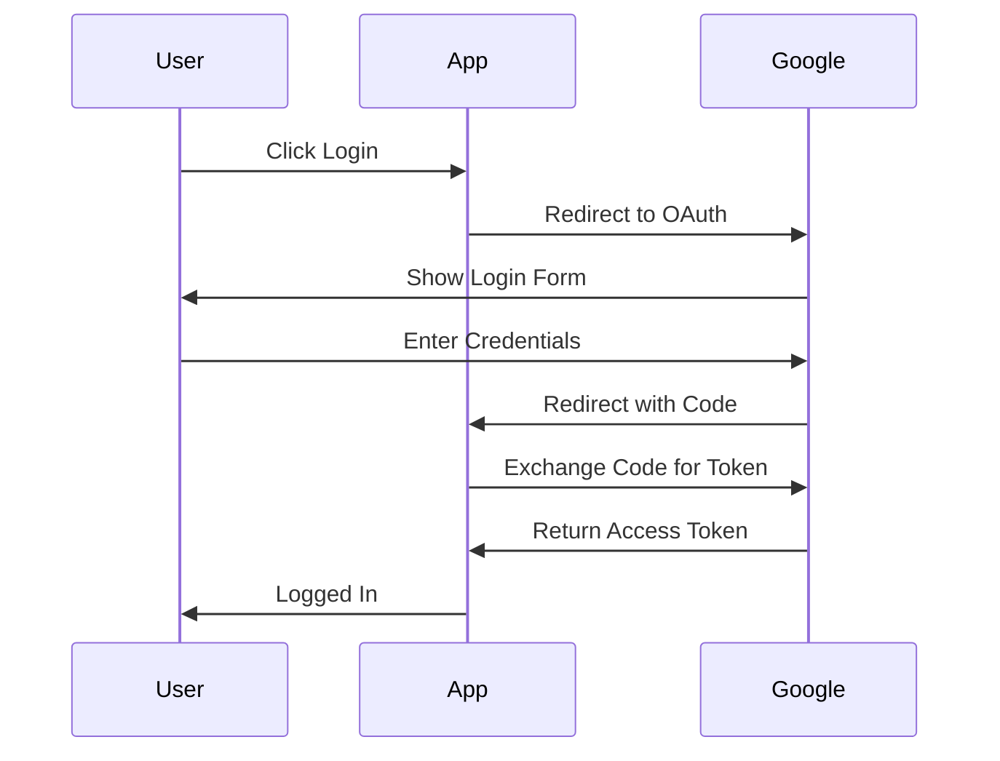

# Media Types Reference

Detailed guidance on when and how to use each media type to supplement video clips.

## 1. Logos

### When to Use
- Company or product is **mentioned by name** in the clip
- Speaker is **demonstrating** or **reviewing** a product
- **Comparison** between multiple products/services
- Speaker **recommends** a specific tool or service

### Sources (Priority Order)
1. **Brandfetch CDN** (free, no key needed)
   - URL: `https://logo.clearbit.com/{domain}`
   - Fallback: `https://cdn.brandfetch.io/id/{domain}/w/400/h/400`
2. **Playwright**: Navigate to company website, screenshot logo element
3. **Google Images**: Search "{company} logo transparent png"

### Quality Guidelines
- Prefer **transparent PNG** backgrounds
- Minimum resolution: **200x200px**
- Prefer **primary/main logo** over alternate versions
- Get both **light and dark** variants if available

### Examples

| Clip Content | Logo to Fetch |
|-------------|---------------|
| "I've been using Vercel for deployment" | vercel.com |
| "GitHub Actions handles our CI/CD" | github.com |
| "The Stripe API is really well designed" | stripe.com |

---

## 2. Reaction/Meme GIFs

### When to Use
- **High-energy reactions**: excitement, shock, frustration
- **Humor moments**: jokes, funny observations
- **Relatable moments**: shared experiences, memes
- **Emphasis**: to amplify an emotional point

### Sources
1. **GIPHY API** (primary)
   - Best for: reactions, emotions, memes
   - Rate limit: 100/hour (beta key)
2. **Tenor API** (fallback)
   - Best for: broader search, Google integration

### Search Strategy

Map clip emotions to search terms:

| Clip Emotion | Search Terms |
|-------------|--------------|
| Excitement | "excited", "celebration", "yes", "amazing" |
| Shock/Surprise | "shocked", "mind blown", "surprised", "what" |
| Frustration | "frustrated", "facepalm", "annoyed", "ugh" |
| Humor | "laughing", "lol", "funny", "haha" |
| Confusion | "confused", "what", "huh", "thinking" |
| Agreement | "nodding", "yes", "exactly", "this" |
| Sarcasm | "sure", "okay", "right", "eye roll" |

### Quality Guidelines
- Prefer **MP4** format over GIF (smaller file size)
- Max duration: **5 seconds** (loops well)
- Avoid GIFs with **text overlays** that don't match context
- Check that reaction **matches the tone** (not offensive)

---

## 3. Landing Pages / Screenshots

### When to Use
- Product or service is **demonstrated** in the clip
- Speaker shows **how to do something** with a tool
- **Specific page/feature** is referenced
- **Before/after** comparisons
- **Error messages** or **UI elements** discussed

### Using Playwright MCP

**Basic capture:**
```
1. browser_navigate(url)
2. browser_screenshot()
```

**With interaction:**
```
1. browser_navigate(url)
2. browser_click("Accept cookies")  # dismiss banners
3. browser_scroll("down")           # if needed
4. browser_screenshot()
```

### Screenshot Types

| Type | When to Use | Viewport |
|------|-------------|----------|
| Hero/Above fold | Product overview | 1280x720 |
| Full page | Documentation, pricing | 1280x(full) |
| Specific element | Feature highlight | Element bounds |
| Mobile | Mobile app discussion | 375x812 |

### Quality Guidelines
- **Wait for load**: Use `wait_until="networkidle"` or wait for specific elements
- **Dismiss overlays**: Cookie banners, popups, chat widgets
- **Consistent viewport**: 1280x720 for desktop by default
- **Capture at 2x**: For retina/high-DPI displays

### Common Pages to Capture

| Clip Reference | URL Pattern |
|---------------|-------------|
| "Check out their pricing" | {domain}/pricing |
| "The documentation is great" | {domain}/docs |
| "Sign up for an account" | {domain}/signup |
| "Their dashboard shows..." | {domain}/dashboard (if public) |
| "The GitHub repo has..." | github.com/{org}/{repo} |

---

## 4. Diagrams

### When to Use
- **Technical explanation** of architecture or flow
- **Process walkthrough** with multiple steps
- **Comparison** of approaches or options
- **Relationship** between components
- **Sequence of events** or API calls

### Diagram Types

| Type | Use Case | Mermaid Syntax |
|------|----------|----------------|
| Flowchart | Processes, decisions | `flowchart TD` |
| Sequence | API calls, interactions | `sequenceDiagram` |
| Class | Object relationships | `classDiagram` |
| State | State machines | `stateDiagram-v2` |
| ER | Database schemas | `erDiagram` |
| Gantt | Timelines | `gantt` |

### Generation Process

1. **Analyze clip content** for technical concepts
2. **Identify diagram type** that best represents it
3. **Generate Mermaid code** based on the explanation
4. **Render to PNG** using mermaid-cli

### Example: OAuth Flow

Clip text: "So the user clicks login, gets redirected to Google, authenticates, then Google sends them back with a code..."



### Quality Guidelines
- **Keep it simple**: 5-10 nodes max for clarity
- **Use clear labels**: Full words, not abbreviations
- **Consistent styling**: Use theme or custom colors
- **Match the explanation**: Don't add details not in the clip

---

## 5. Social Media Videos

### When to Use
- Speaker **references a specific video**
- **Example/demo** of what they're discussing
- **Related content** that enhances understanding
- **Viral moment** or **trending topic** mentioned

### Sources & Methods

| Platform | Discovery | Download |
|----------|-----------|----------|
| YouTube | Playwright + search | yt-dlp |
| TikTok | Playwright + search | yt-dlp |
| Instagram | Playwright + search | yt-dlp |
| X/Twitter | Playwright + search | yt-dlp |

### Discovery Workflow

**YouTube:**
```
1. browser_navigate("https://youtube.com/results?search_query={query}")
2. browser_snapshot() → get video URLs
3. Select most relevant video
4. download_video.py {url}
```

**TikTok:**
```
1. browser_navigate("https://tiktok.com/search?q={query}")
2. browser_snapshot() → get video URLs
3. Select most relevant video
4. download_video.py {url}
```

### Search Strategy

| Clip Content | Search Query |
|-------------|--------------|
| "There's this viral TikTok about..." | [topic] + "viral" |
| "I saw a great tutorial on..." | [topic] + "tutorial" |
| "The demo they showed was..." | [product] + "demo" |
| "This tweet went viral..." | Search X for the quote |

### Quality Guidelines
- **Max duration**: 5 minutes (for supplementary content)
- **Prefer official sources**: Brand channels over reposts
- **Check relevance**: Watch first 30 seconds before downloading
- **Respect copyright**: Only use for fair use/educational purposes

### yt-dlp Options

```bash
# Best quality up to 1080p
yt-dlp -f "bestvideo[height<=1080]+bestaudio/best[height<=1080]" {url}

# Extract only first 60 seconds
yt-dlp --download-sections "*0:00-1:00" {url}

# Get thumbnail only
yt-dlp --write-thumbnail --skip-download {url}
```

---

## Decision Matrix

Use this to decide what media to fetch for a clip:

| Clip Contains | Logos | GIFs | Screenshots | Diagrams | Videos |
|--------------|-------|------|-------------|----------|--------|
| Product mention | ✅ | | ✅ | | |
| Emotional reaction | | ✅ | | | |
| Technical explanation | | | | ✅ | |
| How-to demonstration | ✅ | | ✅ | ✅ | |
| Video reference | | | | | ✅ |
| Humor/joke | | ✅ | | | |
| Comparison | ✅ | | ✅ | ✅ | |
| Error/debugging | | | ✅ | | |

## Media Per Clip Guidelines

- **Minimum**: 1 media asset per clip
- **Ideal**: 2-3 complementary assets
- **Maximum**: 5 assets (avoid overwhelming)

**Combination examples:**
- Product review: Logo + Landing page screenshot
- Technical tutorial: Diagram + Screenshot of code/tool
- Reaction moment: GIF + Logo (if product-related)
- Comparison: Multiple logos + Comparison diagram
